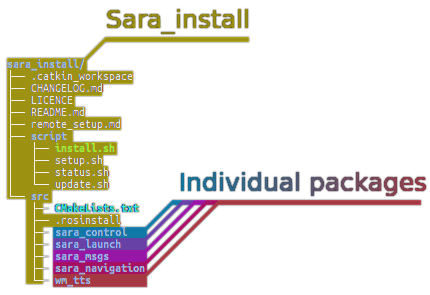

# Sara install

### Repository of rosinstall and install script for easy installation
This repo contains an enclosed catkin workspace along with tools designed to help you manage the versionning of your custom configuration.

Note that since this is a repo containing a workspace containing repos. This will sligtly affect the way you use git on your packages. See the [Workspace versioning layout](#workspace-versioning-layout) section for details.

## Table of content
1. [Recommended tools](#recommended-tools)
1. [Requirements](#requirements)
1. [.rosinstall](#rosinstall)
1. [Workspace versioning layout](#workspace-versioning-layout)
1. [src](#src)
1. [Main workflow](#main-workflow)
1. [Troubleshooting](#troubleshooting)

## Recommended tools
These tool are recommended by Walking Machine to work on Sara. Those are only mere recomendation. You are invited to use your prefered IDE (except visual studio. Yerk!).
1. atom
1. pycharm
1. clion

## Requirements
1. [Ubuntu 16.04 LTS](http://releases.ubuntu.com/16.04/)
1. Install [ROS Kinetic for Ubuntu](https://wiki.ros.org/kinetic/Installation/Ubuntu) by following all steps up to 1.7. The tutorials are good for learners but not needed for Sara.
1.  Install our version control system, git. ``` sudo apt-get install git ```

## .rosinstall
Sara_install uses [wstool](https://wiki.ros.org/wstool). This piece of software uses a configuration file named [.rosinstall](#src/.rosinstall) wich define the list of packages required to install your configuration. Depending on our needs, you can edit this file to change your configuration.

## src
The src directory is the place where all packages are cloned in a catkin workspace. Sara_install is no exception to this rule. The difference is that the packages within src can be managed by wstool.

## Workspace versioning layout
This workspace is special since it is encapsulated within the sara_install git repo. This means that it's configuration is versionnised and you can switch branches to change configuration. Though, you need to keep in mind that the [src directory](#src) is purposely ignored by sara_install. [See .gitignore](#.gitignore). This is to let wstool be the main package manager and also to maintain retrocompatibility whith the old manual workflow. Each packages within src won't be modified by sara_install. They remain their own individual git repositories.



For instance, if you have a custom configuration within your src and want to try another one, you can checkout the new configuration branch without changing the content of your src. You will need to install this new configuration to update your src.

## Main workflow
### First complete installation
If you want to install every packages with their main branches.
1. Clone this repo anywhere ``` git clone https://github.com/WalkingMachine/sara_install.git ```
1. Run the install script ``` ./sara_install/script/install.sh``` and pay attention to the screen. There might be prompts for passwords and stuff.
1. Your are now ready to code.

### Installation for specific development
If you want to work on a specific new feature which require a specific set of packages.
1. Clone this repo anywhere ``` git clone https://github.com/WalkingMachine/sara_install.git ```
1. Create your development branch.``` git checkout -b config/my_awesome_feature_config ```
1. Modify the [.rosinstall file](#src/.rosinstall) to set the packages you need.
1. Run the install script ``` ./sara_install/script/install.sh``` and pay attention to the screen. There might be prompts for passwords and stuff.

### Make modifications
1. Edit code within the desired packages, create feature branches, commit your changes, push them.

```
cd src/my_package
editing
git commit edited_file
git push -u origin feature/my_awesome_feature
```

1. If you need to create a new branch on a package, make sure to also change the [.rosinstall file](#src/.rosinstall) accordingly to match the version/branch.
1. Use the status.sh script to see all modified packages.

### Update all packages
If you need to work with all the latest packages, use the update.sh script.
```
source script/update.sh
```

 ### Scrape the workspace
 If you need to update the .rosinstall file from your custom configuration, use the scrape_config.sh script.
```
source script/scrape_config.sh
```


## Troubleshooting

* catkin_make not found
  1. Close the terminal and reopen it.
* Build error, finished before reaching [100%]
  1. Look for indacation of missing packages. Install them if you can and create a issue mentionning the error on [the issue tracker](https://github.com/WalkingMachine/sara_install/issues).
